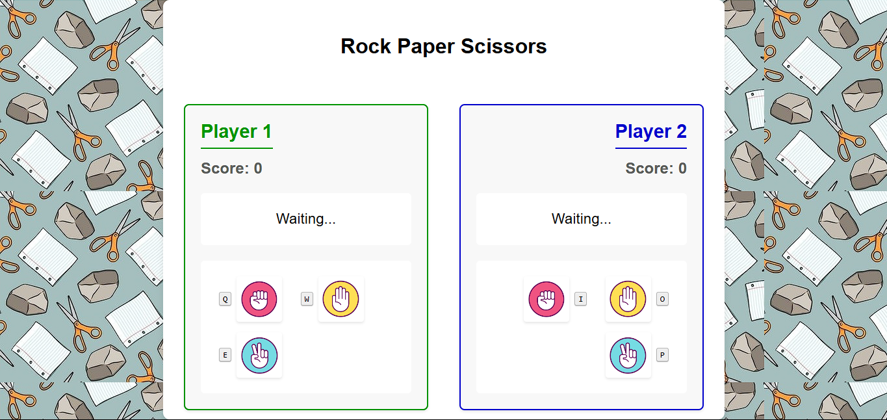

# Rock Paper Scissors Multiplayer Game



A simple multiplayer Rock-Paper-Scissors game built with HTML, CSS, and JavaScript. Play head-to-head with a friend using keyboard controls!

## Features

- 🕹️ **Local multiplayer** - Two players on one keyboard
- 🎮 **Simple controls** - Intuitive keyboard inputs
- 🖼️ **Visual feedback** - Game state animations and images
- ⏱️ **Countdown timer** - Synchronized game start
- 📊 **Score tracking** - Persistent score display
- 🎨 **Responsive design** - Works on different screen sizes

## How to Play

1. **Player 1 Controls**:
   - `Q` - Rock ✊
   - `W` - Paper 🖐️
   - `E` - Scissors ✌️

2. **Player 2 Controls**:
   - `I` - Rock ✊
   - `O` - Paper 🖐️
   - `P` - Scissors ✌️

3. **Game Flow**:
   - Players choose simultaneously using their keys
   - Results appear automatically after both players select
   - Game resets after 2 seconds for next round
   - First to 5 wins gets a victory message!

## Installation & Running

1. Clone the repository:
   ```bash
   git clone https://github.com/mrleos/rock-paper-scissors.git
